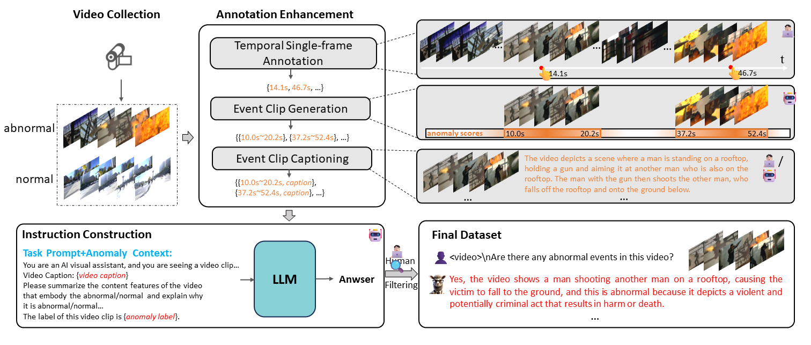
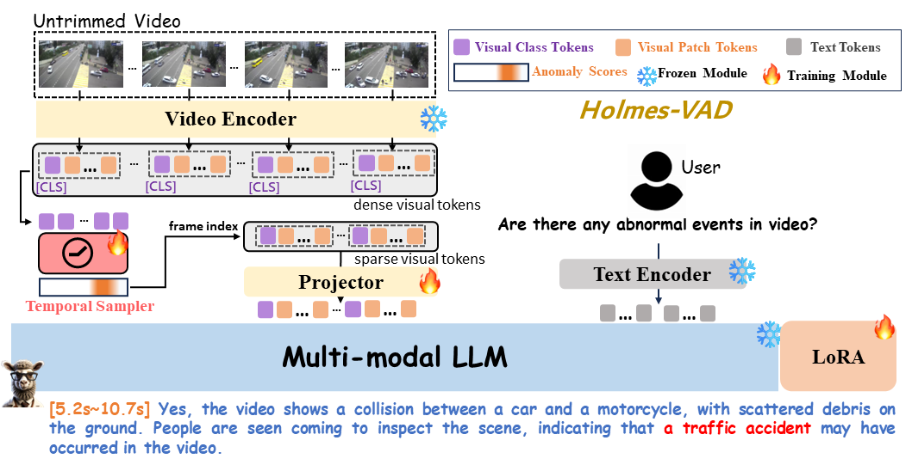

<div align="center">

<h2 align="center"> <a href="https://arxiv.org/abs/2406.12235">Holmes-VAD: Towards Unbiased and Explainable
Video Anomaly Detection via Multi-modal LLM</a></h2>
<h5 align="center"> If you like our project, please give us a star ⭐ on GitHub for latest update.  </h2>

[🎨 Project Page](https://holmesvad.github.io/)

</div>

## 📰 News
* **[2024.07.01]** 🔥🔥🔥 Our inference code is available, and we release our model at [[HolmesVAD-7B]](https://huggingface.co/ppxin321/HolmesVAD-7B).
* **[2024.06.12]** 👀 Our **HolmesVAD** and **VAD-Instruct50k** will be available soon, welcome to **star** ⭐ this repository for the latest updates.


## 😮 Highlights
Towards open-ended Video Anomaly Detection (VAD), existing methods often exhibit biased detection when faced with challenging or unseen events and lack interpretability. To address these drawbacks, we propose Holmes-VAD, a novel framework that leverages precise temporal supervision and rich multimodal instructions to enable accurate anomaly localization and comprehensive explanations.
- Firstly, towards unbiased and explainable VAD system, we construct the first largescale multimodal VAD instruction-tuning benchmark, i.e., VAD-Instruct50k. This dataset is created using a carefully designed semi-automatic labeling paradigm. Efficient single-frame annotations are applied to the collected untrimmed videos, which are then synthesized into high-quality analyses of both abnormal and normal video clips using a robust off-the-shelf video captioner and a large language model (LLM). 
<!-- Model Image-->
<section class="hero teaser">
  <div class="container is-max-desktop">
    <div class="hero-body">
      
    </div>
  </div>
</section>
<!-- End Model Image -->

- Building upon the VAD-Instruct50k dataset, we develop a customized solution for interpretable video anomaly detection. We train a lightweight temporal sampler to select frames with high anomaly response and fine-tune a multimodal large language model (LLM) to generate explanatory content.
<!-- Model Image-->
<section class="hero teaser">
  <div class="container is-max-desktop">
    <div class="hero-body">
      
    </div>
  </div>
</section>
<!-- End Model Image -->


## 🛠️ Requirements and Installation
* Python >= 3.10
* Pytorch == 2.0.1
* CUDA Version >= 11.7
* transformers >= 4.37.2
* Install required packages:

```bash
# inference only
git clone https://github.com/pipixin321/HolmesVAD.git
cd HolmesVAD
conda create -n holmesvad python=3.10 -y
conda activate holmesvad
pip install --upgrade pip  # enable PEP 660 support
pip install -e .
pip install decord opencv-python pytorchvideo
```

```bash
# additional packages for training
pip install -e ".[train]"
pip install flash-attn --no-build-isolation
```

## 🤗 Demo

### CLI Inference

```bash
CUDA_VISIBLE_DEVICES=0 python demo/cli.py --model-path ./checkpoints/HolmesVAD-7B --file ./demo/examples/vad/RoadAccidents133_x264_270_451.mp4
```

### Gradio Web UI

```bash
CUDA_VISIBLE_DEVICES=0 python demo/gradio_demo.py
```


## Stargazers over time
[](https://starchart.cc/caoyunkang/Segment-Any-Anomaly)

## Citation

If you find this repo useful for your research, please consider citing our paper:

```bibtex
@article{zhang2024holmes,
  title={Holmes-VAD: Towards Unbiased and Explainable Video Anomaly Detection via Multi-modal LLM},
  author={Zhang, Huaxin and Xu, Xiaohao and Wang, Xiang and Zuo, Jialong and Han, Chuchu and Huang, Xiaonan and Gao, Changxin and Wang, Yuehuan and Sang, Nong},
  journal={arXiv preprint arXiv:2406.12235},
  year={2024}
}
```
---